<link href="https://cdnjs.cloudflare.com/ajax/libs/lightbox2/2.11.3/css/lightbox.min.css" rel="stylesheet" />

 
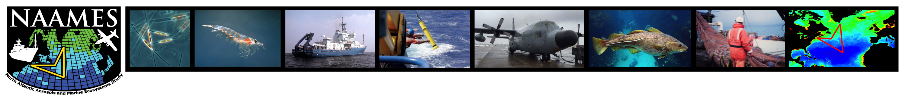

<h3>**The North Atlantic Aerosols and Marine Ecosystems Study (NAAMES)**</h3>

 

NAAMES was a five-year NASA study (2015-2019) that looked at the influences of phytoplankton on atmospheric aerosols and clouds. As part of NAAMES, the contribution of Dr. Stephen Giovannoni and myself was to generate 16S rRNA amplicon profiles to have a highly-resolved identification of the plankton communties.  I participated in 3 out of 4 field campaigns. Find more details for each campaign in the buttons below 

 Click the links below for more informartion about the NAAAMES project.

[**NAAMES official website**](https://naames.larc.nasa.gov)  
[**Notes from the field NASA Earth Observatory**](https://earthobservatory.nasa.gov/blogs/fromthefield/category/naames/) 
[**Tiny organisms, giant impact**](https://climate.nasa.gov/news/2621/tiny-organisms-giant-impact/) 

***
## NAAMES 2

  NAAMES 2 took place in May 2016. Departing from Woodshole, MA to our first station at latitude ~51 N.

 

  
  
  <a href="images/N2_bottles.jpg" data-lightbox="naames2" data-title="Image 3 description">
    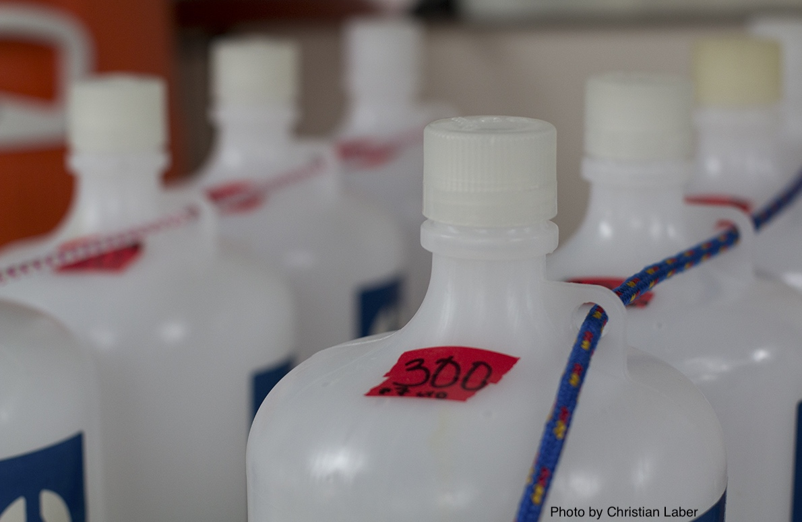
  </a>

## NAAMES 3

NAAMES 3 took place in September 2017. Departing from Woodshole, MA to our first station at latitude ~42 N.

 

  <a href="images/N3_yo.jpg" data-lightbox="naames2" data-title="Image 1 description">
    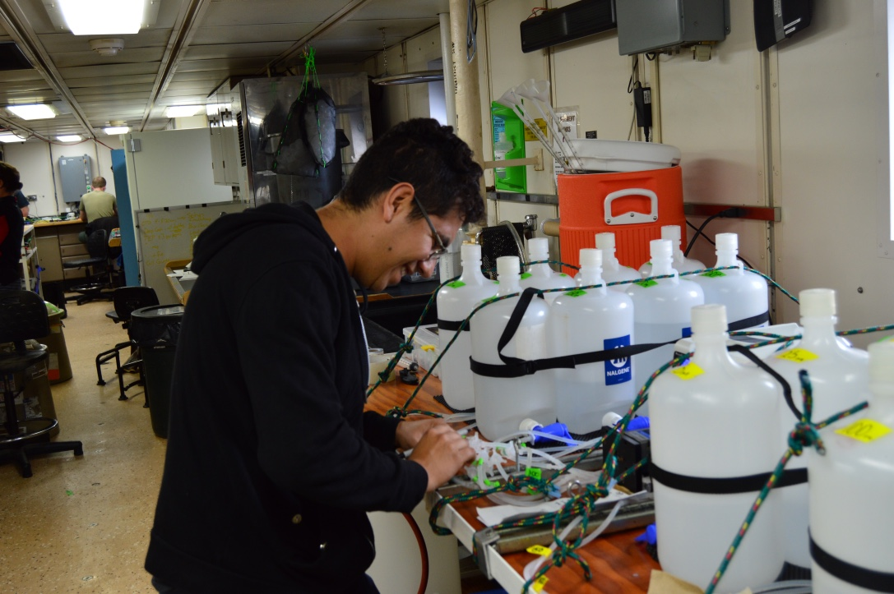
  </a>
  <a href="images/N3_all.jpg" data-lightbox="naames2" data-title="Image 2 description">
    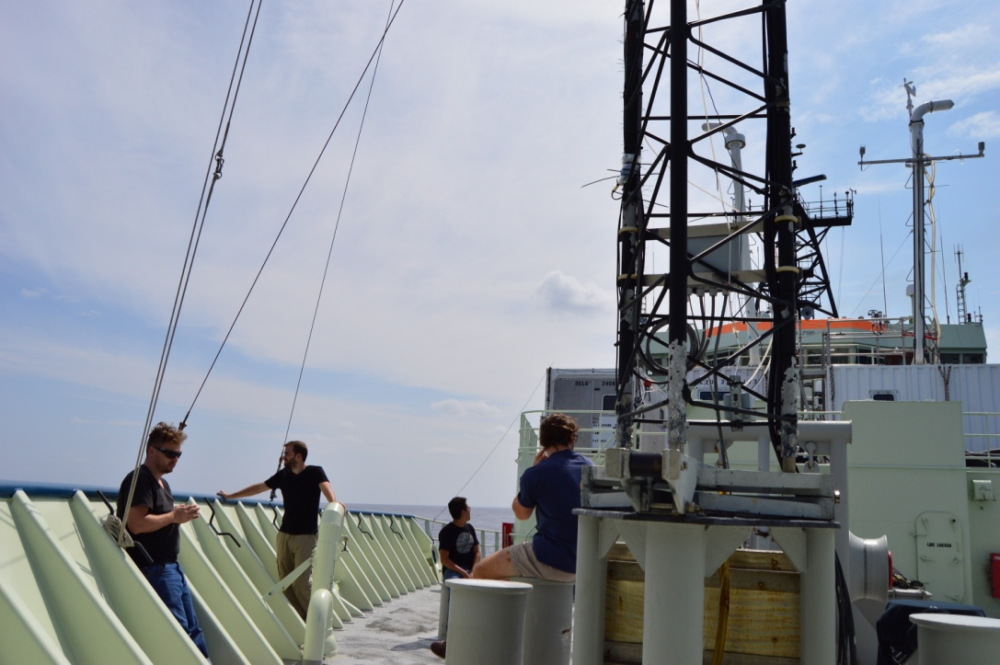
  </a>
  <a href="images/N3_sunst.jpg" data-lightbox="naames2" data-title="Image 3 description">
    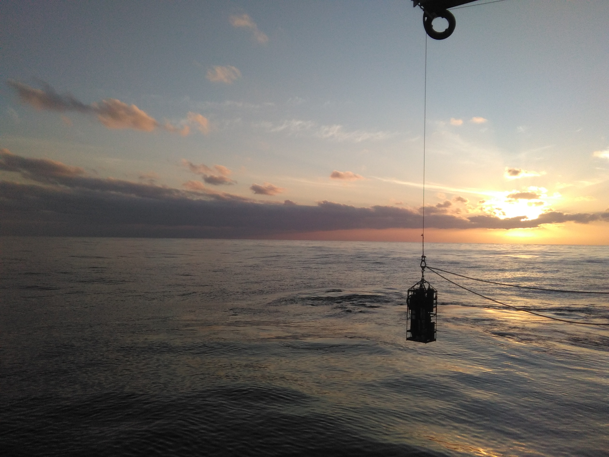
  </a>

## NAAMES 4

NAAMES 4 took place in March-April 2018. Departing from San Juan, PR to the first station at latitude ~32 N.
  

This cruise was featured on Chronicle 5 WCVB. Click on the links to see the videos.
  
[**On board a floating sea lab / ep 1**](https://www.youtube.com/watch?v=Fp3bNkXzbLI) 
[**Scientific research that cannot be done on shore / ep 2**](https://www.youtube.com/watch?v=YKbHJHfChSw) 
[**Working aboard the R/V Atlantis during turbulent seas / ep 3**](https://www.youtube.com/watch?v=gUUoa9JgujE) 
[**Researching the secrets of the sea / ep 4**](https://www.youtube.com/watch?v=O5QAg8L_xNM) 
 
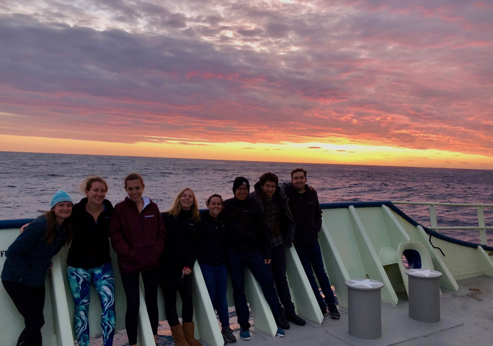
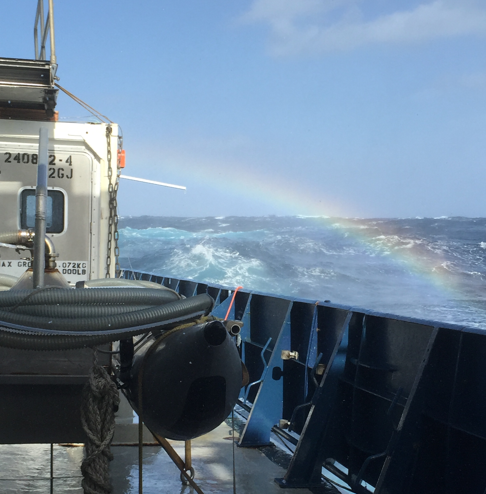
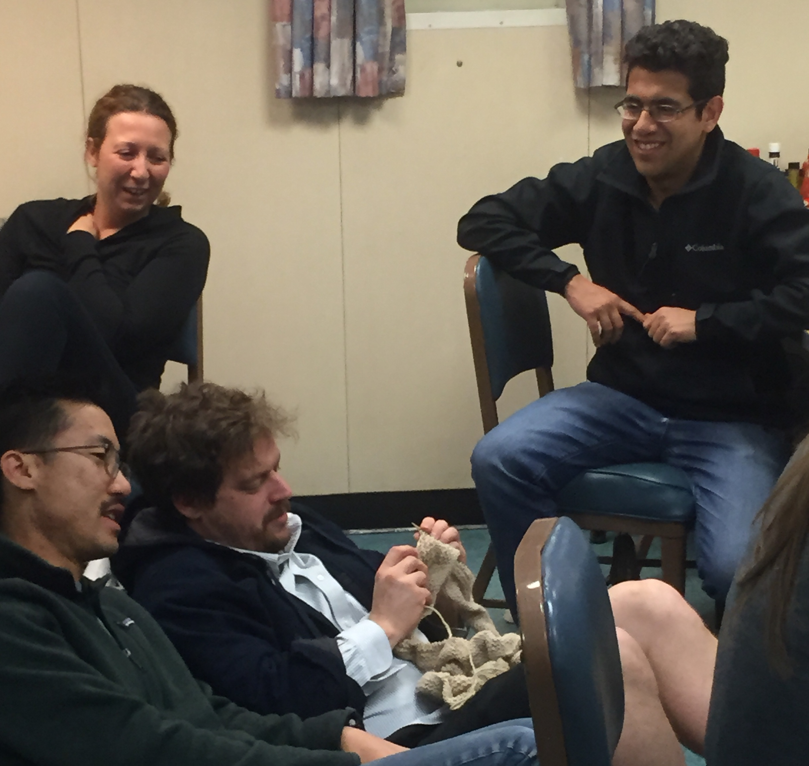

# {-}
 
 
 
 
 
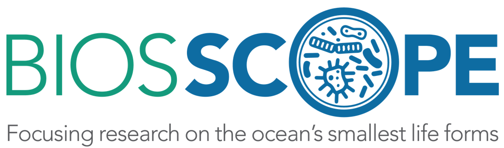
 
 

BIOS-SCOPE is a five-year multi-institutional research program for the study of microbial oceanography in the North Atlantic Ocean. Established in 2015, BIOS-SCOPE leverages ocean measurements and ongoing research at the Bermuda Atlantic Time-series Study (BATS) site.

 Click the link below for more informartion about the BIOS-SCOPE project.

[**BIOS-SCOPE official website**](http://scope.bios.edu)   

Contributions:  a) rRNA amplicon profile generation and analysis.  b) AE1703 Field Campaign. Charlston, SC to BATS.   c) AE2213 Field Campaign BATS. 

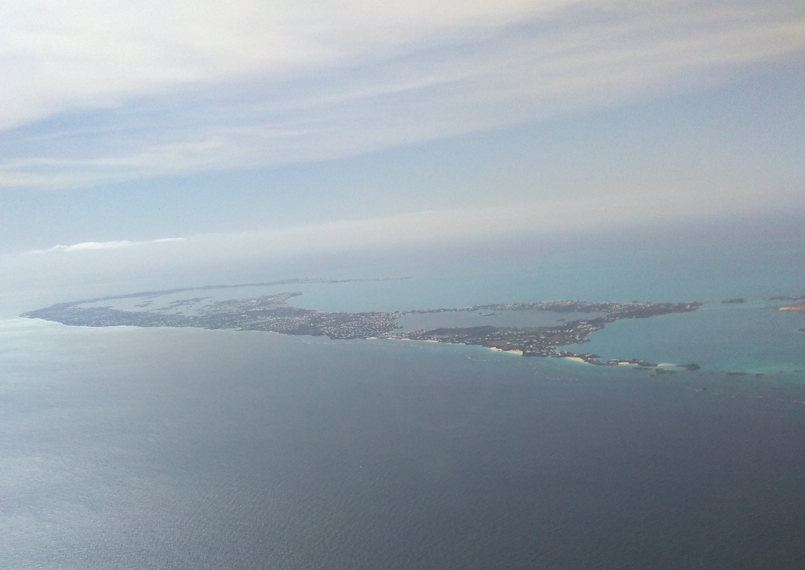
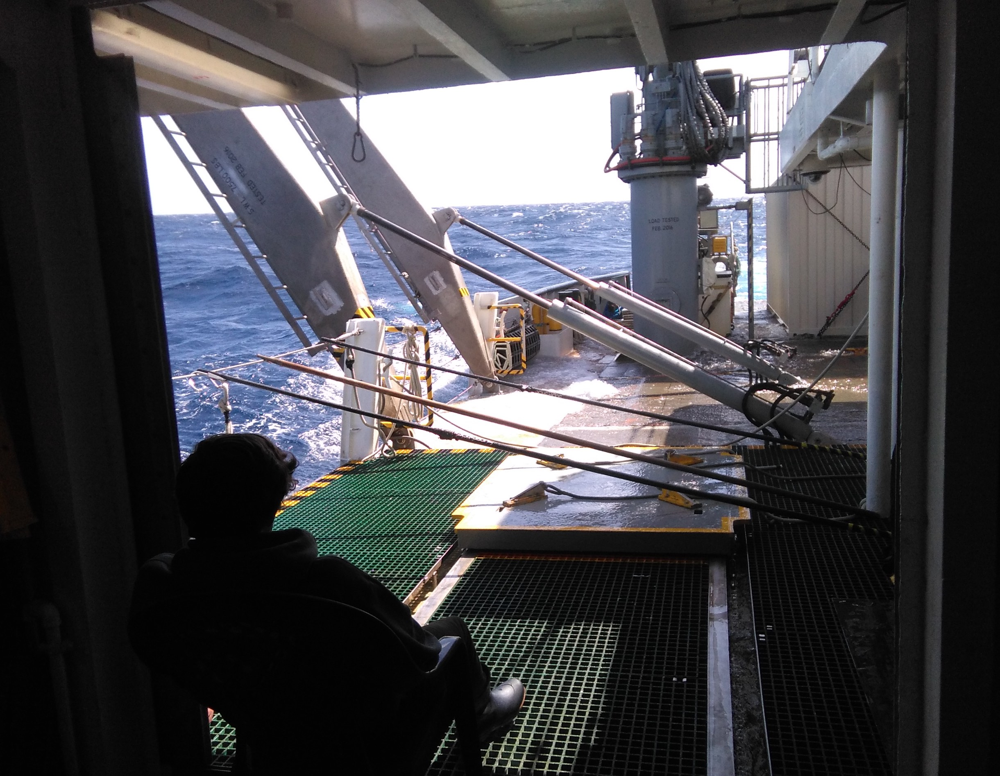
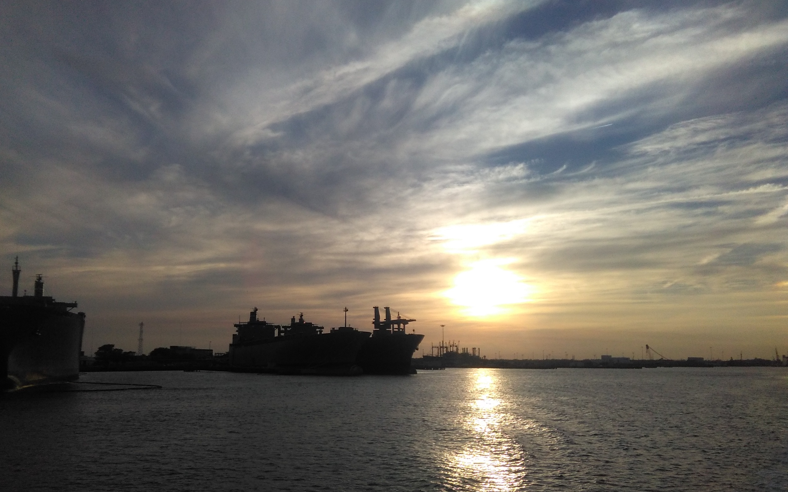

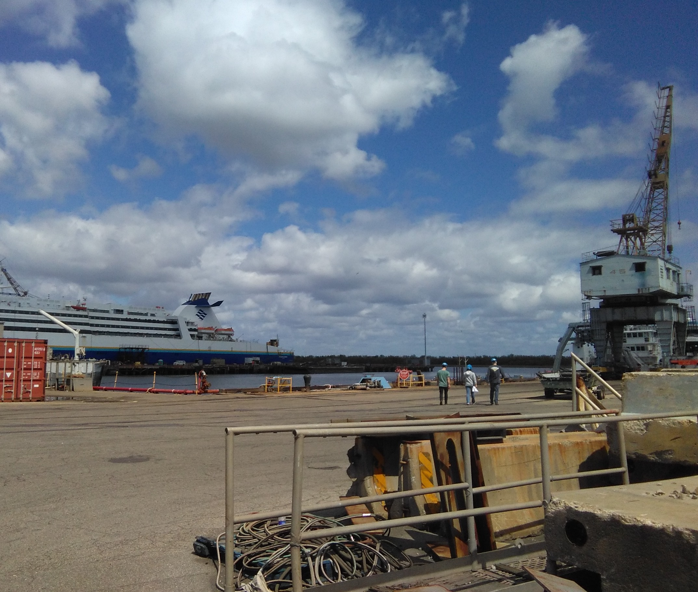
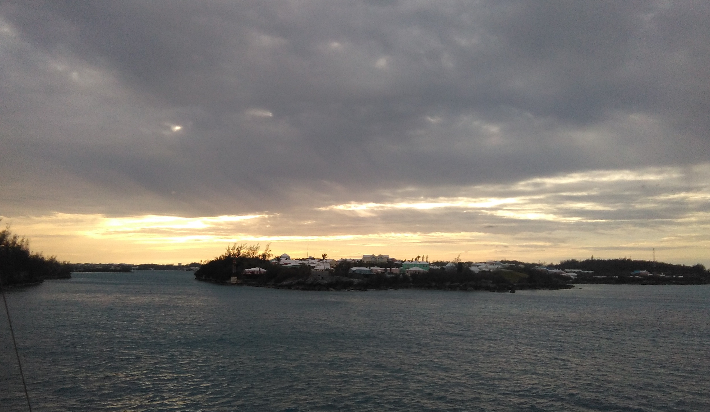
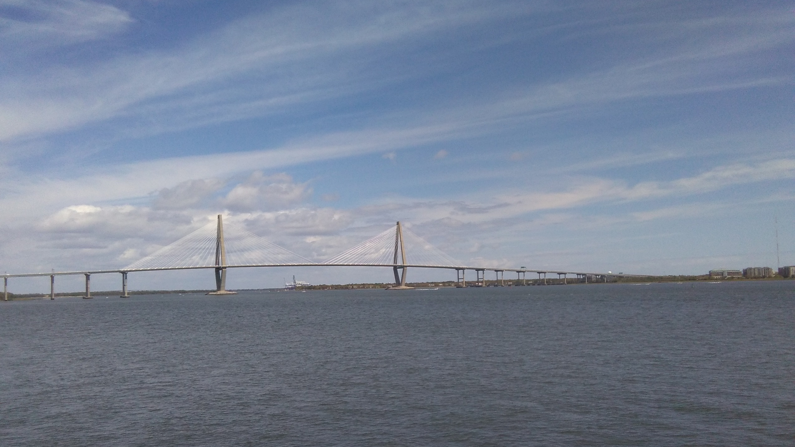

