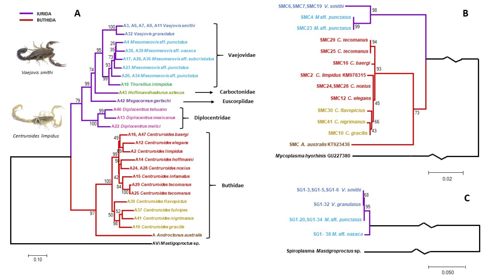

<head>
<meta name="viewport" content="width=device-width, initial-scale=1">

</head>

<h1>Research Interests</h1>
 
<h2>Marine Microbial Diversity and Ecology</h2>

  

<right>
 Marine microbes are a fundamental part of the earth's biosphere. Their unique metabolism, versatility and intricate interactions contribute to important steps of the elements' biogechemical cycles.
</right>
 
<right>
 My interests reside on studying the biogegraphical distributions of microbial communities; from virueses to phytoplankton. How these distributions determine ecological clusters through latitudinal gradients is a question, I believe, will provide a more accurate biological framework to understand and model the impact of microbes to the ocean and the atmosphere. 
</right>
 
<right>
How microbial transport across these regions, seasonality and biological interactions will be affected under the ocean warming scenario and what will be the effects on the global biogeochemistry are driving questions of my research.  
</right>
  

  

   

<figcaption>
 Diagram depicting the shifts in the subpolar phytoplankton community composition. Top: Winter. Bottom: Spring (Bolaños et al., 2020) </figcaption>
  

 
 
 
 
 
 
 
 
<h2>Minimal Genomes: Ecology and Evolution</h2>

  

 

<figcaption>
 Pelagibacter ubique HTCC1062 infected with HTVC011P. P. ubique, strain HTCC1062, is known to be one of smallest and simplest, self-replicating, and free living cell (Y Zhao et al. Nature 494, 357-360, 2013 doi:10.1038/nature11921) </figcaption>
 
<b>
<cite>"SAR11 is one of the most exciting puzzles of contemporary microbiology"</cite></b> Ass. Prof. A. Murat Eren 

  

  

  <right>
 The minimal genome concept hypothetize that a cell can live and replicate with a bare minimum set of essential genes. Some naturally recurring bacteria have reduced genomes, specially those that live as intracellular symbionts and have delegated many of their functions to their hosts.
</right>

<right>
 My interests reside on two fascinating groups of organisms: SAR11 and Mycoplasma spp. SAR11 is not only the most abundant planktonic cell in the surface ocean, it has the smallest self-replicating genome. With large effective population sizes, SAR11 is a highly diverse group of bacteria. The minnimalism, efficiency and metabolic versatility of SAR11 makes it one of the most succesfull organisms on earth. 
</right>

<right>
Mycoplasma is found naturally as symbiont of multiple organisms. It is a key model to reconstruct a minimal genome and synthetic biology experimentation. 
</right>
 
  

 
 
 
 
 
 
 
<h2>Eukaryotic-Bacteria Symbiosis</h2>

  

<right>
 Since the proposal of the serial endosymbiotic theory of the eukaryotic cell genesis by Lynn Margulis, symbiosis has been recognized as a fundamental driver of evolution. In the biological space of possibilities, multiple and diverse bacteria-eukaryotic associations have been studied, from insect endosymbionts to the gut microbiome of mammals.
</right>
 
<right>
 My PhD thesis uncovered a divergent bacteria that we hypothesized are ancient endosymbionts of scorpions and widespread in non-insect arthropods. On land and in aquatic environments, invertebrates compose a large fraction of the biomass and its associations with arthropods have an important effect on their fitness, which may impact in multiple ways the stability of the ecosystems and the evolution of the organisms. How these associations will be affected under warming scenarios and other disturbances cuased by climate change constitutes a fundamental interest to my research. 
</right>
 
  

  

   

<figcaption>
 Comparison of scorpion and symbiont phylogenies suggesting a coespeciation process (Bolaños et al., 2019) </figcaption>

  

 
 
 
 
 
 
</html>

